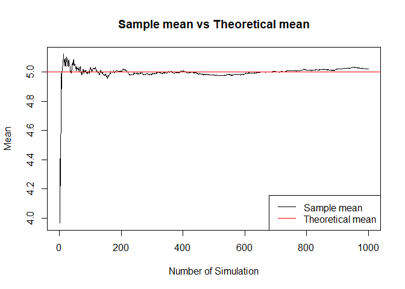
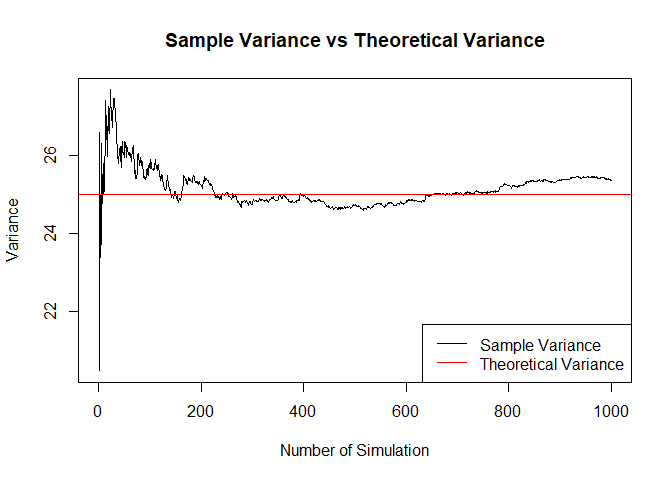
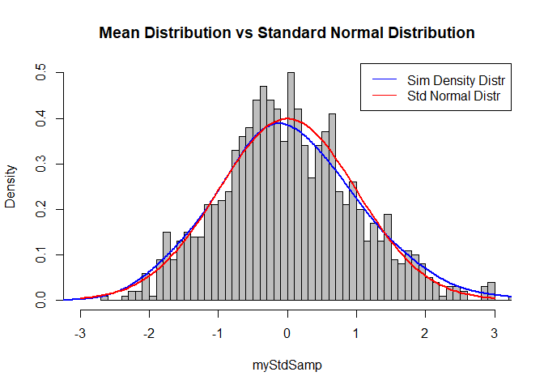

# Simulating the Exponential Distribution
Marco Letico  
02 August 2017  


## Overview

In this project we will investigate the exponential distribution in R and compare it with the Central Limit Theorem. The exponential distribution can be simulated in R with rexp(n, lambda) where lambda is the rate parameter. The mean of exponential distribution is 1/lambda and the standard deviation is also 1/lambda. We set lambda = 0.2 for all of the simulations. We will investigate the distribution of averages of 40 exponentials within a thousand simulations.


```r
# Set parameters
myLambda <- 0.2
n <- 40
nsim <- 1000
set.seed(1088)

# Create a matrix with 1000 simulation and 40 exponentials. Every simulation for one row.
mySim <- matrix(rexp(n * nsim, rate = myLambda), nsim, n)
```

<br />

#### 1. Show the sample mean and compare it to the theoretical mean of the distribution.


```r
# Perform the mean for every simulation
myMean <- apply(mySim, 1, mean)

# Plot the mean as the number of simulation increases 
means <- cumsum(myMean)/(1:nsim)
plot(x = 1:nsim, y = means, type = "l", main = "Sample mean vs Theoretical mean", 
     xlab = "Number of Simulation", ylab = "Mean")
abline(h = 1/myLambda, col = "red")
legend("bottomright", legend = c("Sample mean","Theoretical mean"), 
       col = c("black", "red"), lty=c(1,1))
```

<!-- -->

In the plot above we can notice how the means are approximately the same as the number of simulation increases. Below we show the values.

```r
sampleMean <- mean(myMean)
theoMean <- 1/myLambda
```


```
## [1] "Sample mean:  5.02009326208063"
```

```
## [1] "Theoretical mean:  5"
```

<br />

#### 2. Show how variable the sample is (via variance) and compare it to the theoretical variance of the distribution.


```r
# Perform the variance for every simulation
myVariance <- apply(mySim, 1, var)

# Plot the variance as the number of simulation increases 
variances <- cumsum(myVariance)/(1:nsim)
plot(x = 1:nsim, y = variances, type = "l", main = "Sample Variance vs Theoretical Variance", 
     xlab = "Number of Simulation", ylab = "Variance")
abline(h = (1/myLambda)^2, col = "red")
legend("bottomright", legend = c("Sample Variance","Theoretical Variance"), 
       col = c("black", "red"), lty=c(1,1))
```

<!-- -->

The result below shows that also the sample variance is close to the theoretical variance.


```r
# Perform the variance for every simulation
myVariance <- apply(mySim, 1, var)

sampleVariance <- mean(myVariance)
theoVariance <- (1/myLambda)^2
```


```
## [1] "Sample variance:  25.364971171212"
```

```
## [1] "Theoretical variance:  25"
```

<br />

#### 3. Show that the distribution is approximately normal.
To show we have to apply the Central Limit Theorem (CLT), that states that: $\frac{\bar X_n - \mu}{\sigma / \sqrt{n}}$ has a distribution like that of a standard normal for large n.


```r
# Applying the CLT
myStdSamp <- (myMean - theoMean) / (1/myLambda / sqrt(n))

# Plot the the histogram of the means and add his density function.
hist(myStdSamp, prob = TRUE, breaks = 50, col = "grey", 
     main = "Mean Distribution vs Standard Normal Distribution", xlim = c(-3, 3))
lines(density(myStdSamp, adjust = 2), lwd = 2, col = "blue")

# And now add the density function of a standard normal distribution
lines(seq(-3, 3, length = 100), dnorm(seq(-3, 3, length = 100)), col = "red", lwd = 2)

legend("topright", legend = c("Sim Density Distr","Std Normal Distr"), 
       col = c("blue", "red"), lty=c(1,1))
```

<!-- -->
