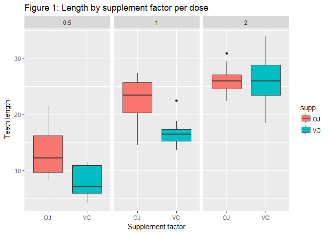
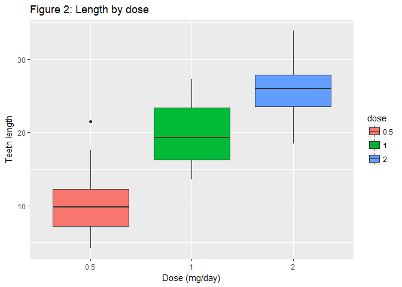

# Tooth Growth Data Analysis
Marco Letico  
03 August 2017  


```r
library(ggplot2); library(datasets); data(ToothGrowth)
ToothGrowth$dose <- as.factor(ToothGrowth$dose)
```

## Exploratory data analysis

Let's start with some basic functions describing the data.

```r
str(ToothGrowth)
```

```
## 'data.frame':	60 obs. of  3 variables:
##  $ len : num  4.2 11.5 7.3 5.8 6.4 10 11.2 11.2 5.2 7 ...
##  $ supp: Factor w/ 2 levels "OJ","VC": 2 2 2 2 2 2 2 2 2 2 ...
##  $ dose: Factor w/ 3 levels "0.5","1","2": 1 1 1 1 1 1 1 1 1 1 ...
```

Now we are going to plot the comparison between type of vitamin C per dose and show a brief summary.

```r
g <- ggplot(ToothGrowth, aes(x = supp, y = len, fill = supp)) 
g <- g + geom_boxplot() + facet_grid(~ dose)
g + ggtitle("Figure 1: Length by supplement factor per dose") + 
        xlab("Supplement factor") + ylab("Teeth length")
```

<!-- -->

```r
by(ToothGrowth$len, INDICES = list(ToothGrowth$supp, ToothGrowth$dose), summary)
```

```
## : OJ
## : 0.5
##    Min. 1st Qu.  Median    Mean 3rd Qu.    Max. 
##    8.20    9.70   12.25   13.23   16.18   21.50 
## -------------------------------------------------------- 
## : VC
## : 0.5
##    Min. 1st Qu.  Median    Mean 3rd Qu.    Max. 
##    4.20    5.95    7.15    7.98   10.90   11.50 
## -------------------------------------------------------- 
## : OJ
## : 1
##    Min. 1st Qu.  Median    Mean 3rd Qu.    Max. 
##   14.50   20.30   23.45   22.70   25.65   27.30 
## -------------------------------------------------------- 
## : VC
## : 1
##    Min. 1st Qu.  Median    Mean 3rd Qu.    Max. 
##   13.60   15.27   16.50   16.77   17.30   22.50 
## -------------------------------------------------------- 
## : OJ
## : 2
##    Min. 1st Qu.  Median    Mean 3rd Qu.    Max. 
##   22.40   24.58   25.95   26.06   27.08   30.90 
## -------------------------------------------------------- 
## : VC
## : 2
##    Min. 1st Qu.  Median    Mean 3rd Qu.    Max. 
##   18.50   23.38   25.95   26.14   28.80   33.90
```

It is important also to show the relationship between the doses independently from the type of vitamin C in order to see if there could be a relationship between dose and tooth length.

```r
g <- ggplot(ToothGrowth, aes(x = dose, y = len, fill = dose)) 
g <- g + geom_boxplot() 
g + ggtitle("Figure 2: Length by dose") + xlab("Dose (mg/day)") + ylab("Teeth length")
```

<!-- -->

## Assumption

1. The doses and the form of vitamin C have been assigned randomly to the guinea pigs. So we can consider the data as iid.

2. The variances between populations are different

3. Vitamin C has been assigned to 60 different example of guinea pigs. For this reason we can consider the data as not paired.

## Hypothesis Testing

From the boxplot in Figure 1 it seems that to Orange Juice are associated higher tooth length for the dose 0.5 and 1, but not for the dose 2.

To test this we are going, in a first moment, to split the data as below. Let's take firstly the case with dose 0.5:


```r
dataOJ <- subset(ToothGrowth, dose %in% c(0.5) & supp %in% "OJ")
dataVC <- subset(ToothGrowth, dose %in% c(0.5) & supp %in% "VC")

# Set up the variables
n1 <- length(dataOJ$len)
n2 <- length(dataVC$len)
x1 <- mean(dataOJ$len)
x2 <- mean(dataVC$len)
v1 <- var(dataOJ$len)
v2 <- var(dataVC$len)
```

Then we set up our hyphotesis as: $H_0 : \mu_x = \mu_y$ and $H_a : \mu_x \neq \mu_y$

In this case we need a two sided test and, as the number of observation is small, we are going to use the Gosset's t distribution.

When our observations are iid and their variances are unequal we have to use a Welch Two Sample t-test with adjusted degrees of freedom. This because it turns out that if the x and y observations are iid normal potentially with different means and variances, the relevant normalized statistic does not follow a t distribution. Instead it could be approximated by a t distribution if we choose the degrees of freedom given by the formula below:
$$ df = \frac{(S_x^2/n_x + S_y^2/n_y)^2}{(S_x^2/n_x)^2 / (n_x - 1) + (S_y^2/n_y)^2 / (n_y - 1)}$$

```r
df <- (v1/n1 + v2/n2)^2 / ((v1/n1)^2/(n1-1) + (v2/n2)^2/(n2-1))
df
```

```
## [1] 14.96875
```

Our confidence interval will be given by the formula:
$$ \bar Y - \bar X \pm t_{df} \times \bigg({\frac{S^2_x}{n_x}+ \frac{S^2_y}{n_y}}\bigg)^{1/2}$$

```r
(x1 - x2) + c(-1, 1) * qt(0.975, df) * sqrt(v1/n1 + v2/n2)
```

```
## [1] 1.719057 8.780943
```

Now let's calculate the t statistic, that says how much is far our observed value from our value under the null hypotesis. The t statistic in the case of our selected hyphotesis and unequal variances will be:
$$ \frac{\bar Y - \bar X - (\mu_x - \mu_y)}{\sqrt{\frac{S^2_x}{n_x} + \frac{S^2_y}{n_y}}}$$

```r
ts <- (x1 - x2) / sqrt(v1/n1 + v2/n2)
ts
```

```
## [1] 3.169733
```

We reject the null hypotesis in favor of the alternative hypothesis when $t > t_{0.025, df} = 2.1318$


```r
qt(0.025, df)
```

```
## [1] -2.131837
```

We choose 0.025 as our test is two-sided. In our case it turns out that our observed mean difference is distant 3.1697 standard deviation from 0, value higher than 2.1318.

As 3.1697 falls in the rejection region, we reject the null hyphotesis. It means that the means of the two different treatments are not equal and that to Oranje juice are associated higher values of tooth lenght.

The same decision is it possible to observe with the p-value test. The p-value is the probability of obtaining a result beyond your test statistic on the appropriate distribution. As our case is a two sided test we will double our p value.


```r
2 * pt(ts, df, lower.tail = FALSE)
```

```
## [1] 0.006358607
```

Therefore, the probability of seeing evidence as extreme or more extreme than that actually obtained
under $H_0$ is 0.006359. So, (assuming our model is correct) either we observed data that was pretty
unlikely under the null, or the null hypothesis if false.

Because $P = 0.006359 \leqslant \alpha = 0.05$, we reject the null hypothesis in favor of the alternative hypothesis.

The same result could be obtained quickly with the following R built-in function.


```r
t.test(dataOJ$len, dataVC$len, paired = F, var.equal = F, alternative = "two.sided", 
       conf.level = 0.95)
```

```
## 
## 	Welch Two Sample t-test
## 
## data:  dataOJ$len and dataVC$len
## t = 3.1697, df = 14.969, p-value = 0.006359
## alternative hypothesis: true difference in means is not equal to 0
## 95 percent confidence interval:
##  1.719057 8.780943
## sample estimates:
## mean of x mean of y 
##     13.23      7.98
```

Let's repeat the process for the other 2 levels of dose.


```r
lapply(1:2, function(i){
        dataOJ <- subset(ToothGrowth, dose %in% c(i) & supp %in% "OJ")
        dataVC <- subset(ToothGrowth, dose %in% c(i) & supp %in% "VC")

t.test(dataOJ$len, dataVC$len, paired = F, var.equal = F, alternative = "two.sided", 
       conf.level = 0.95)
})
```

```
## [[1]]
## 
## 	Welch Two Sample t-test
## 
## data:  dataOJ$len and dataVC$len
## t = 4.0328, df = 15.358, p-value = 0.001038
## alternative hypothesis: true difference in means is not equal to 0
## 95 percent confidence interval:
##  2.802148 9.057852
## sample estimates:
## mean of x mean of y 
##     22.70     16.77 
## 
## 
## [[2]]
## 
## 	Welch Two Sample t-test
## 
## data:  dataOJ$len and dataVC$len
## t = -0.046136, df = 14.04, p-value = 0.9639
## alternative hypothesis: true difference in means is not equal to 0
## 95 percent confidence interval:
##  -3.79807  3.63807
## sample estimates:
## mean of x mean of y 
##     26.06     26.14
```

In the case of 1 mg we reject again the null hyphotesis but we fail to reject the null hypotesis in the case of 2 mg.

It is important also to test if there is evidence that with an higher dose of vitamin C per day, independently by the form received, are associated higher tooth length. See Figure 2.


```r
data1 <- subset(ToothGrowth, dose %in% c(0.5, 1))
data2 <- subset(ToothGrowth, dose %in% c(0.5, 2))
data3 <- subset(ToothGrowth, dose %in% c(1, 2))

t.test(len ~ dose, data = data1, paired = F, var.equal = F, alternative = "two.sided", 
       conf.level = 0.95)
```

```
## 
## 	Welch Two Sample t-test
## 
## data:  len by dose
## t = -6.4766, df = 37.986, p-value = 1.268e-07
## alternative hypothesis: true difference in means is not equal to 0
## 95 percent confidence interval:
##  -11.983781  -6.276219
## sample estimates:
## mean in group 0.5   mean in group 1 
##            10.605            19.735
```

```r
t.test(len ~ dose, data = data2, paired = F, var.equal = F, alternative = "two.sided", 
       conf.level = 0.95)
```

```
## 
## 	Welch Two Sample t-test
## 
## data:  len by dose
## t = -11.799, df = 36.883, p-value = 4.398e-14
## alternative hypothesis: true difference in means is not equal to 0
## 95 percent confidence interval:
##  -18.15617 -12.83383
## sample estimates:
## mean in group 0.5   mean in group 2 
##            10.605            26.100
```

```r
t.test(len ~ dose, data = data3, paired = F, var.equal = F, alternative = "two.sided", 
       conf.level = 0.95)
```

```
## 
## 	Welch Two Sample t-test
## 
## data:  len by dose
## t = -4.9005, df = 37.101, p-value = 1.906e-05
## alternative hypothesis: true difference in means is not equal to 0
## 95 percent confidence interval:
##  -8.996481 -3.733519
## sample estimates:
## mean in group 1 mean in group 2 
##          19.735          26.100
```

Even in these three cases we reject the null hypotesis that the data are equal because the difference between the means are zero in favor of the alternative hypotesis.

## Conclusion

1. There is evidence that subministrating Oranje juice increses the probability to have length tooth but only with a dose less than 2 mg/day.

2. There is evidence that to higher doses per day correspond higher value in the length of the tooth.
